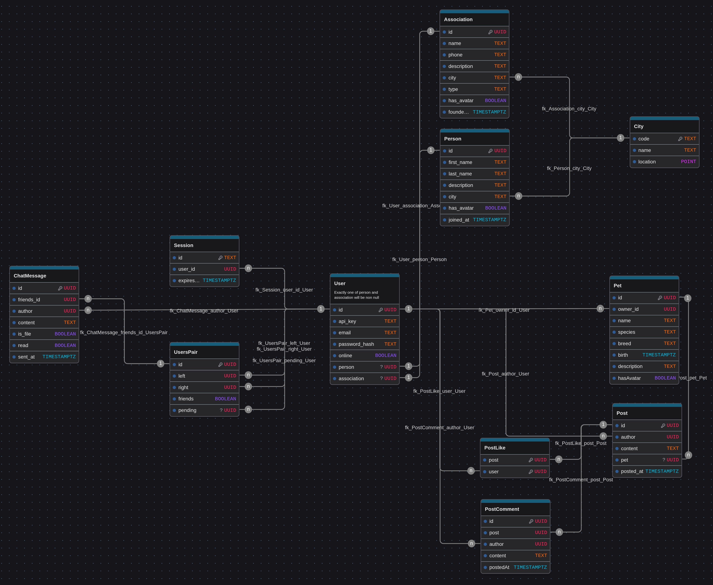

# ft_transcendence

This project has been created as part of the 42 curriculum by
mszymcza, aheisch, wscherre, atrabut.

## Description

__Bibi's Farm__ is a full-stack web application developed as part of the 42 curriculum.
It is a modern, real-time social media platform that allows users to create accounts,
exchange pictures of their pets and interact with animal well-being related associations.

## Instruction

### Before anything

- Tested with Docker 29.0.0 or Podman 5.7.1 (with the `DOCKER` variable set to
`podman` in `Makefile`)
- `cp .env.example .env` and edit `.env` as necessary.
Some variables might be missing from the example file !
- The server will listen on port `8000` by default

### Release

- `make build` to build the container images
- `make up` to deploy the application
- `make down` to remove the containers

### Development

- `make dev` to start the development server
- `make dev-down` to remove the development containers
- `make check` to run CI checks before pushing
- `make format` to format the code

### Tools

- `make reset` to delete the volumes
- `make seed` to seed the database with random data, __will delete existing
data__
- In development, the database can be inspected at [local.drizzle.studio](https://local.drizzle.studio)
- [yaak](https://yaak.app/) can be used to test the API (request files in `./yaak`)
- [drawDB.app](https://www.drawdb.app/editor) can be used to visualize
the database schema with `./drawdb.json`

## Technical Stack

- Docker / Podman (containerization)
- Caddy (reverse proxy)
- Postgres (database)
- Garage (object storage)
- Bun (web application server)
- SvelteKit (full-stack framework)
- TailwindCSS (CSS framework)
- Drizzle (ORM)

### Justification of the stack

- SvelteKit was chosen for it's close adherence to web standards and it's full-stack
architecture that gives a great developer experience.
- Postgres was chosen for it's position as a state-of-the-art open source
relational database system.
- Garage was chosen as the closest alternative to cloud hosted object storage.
- Bun was chosen for it's modern tooling and great performance.
- Drizzle was chosen for it's simple, close to SQL syntax.

## Resources

- [SvelteKit](https://svelte.dev/)
- [Drizzle ORM](https://orm.drizzle.team/)
- [Garage](https://garagehq.deuxfleurs.fr/)
- [PostgreSQL](https://www.postgresql.org/)
- [Tailwind CSS](https://tailwindcss.com/)
- [MDN Web Docs](https://developer.mozilla.org/)
- [Caddy](https://caddyserver.com/)
- [Bun](https://bun.com/)

AI has been used sparingly for scaffolding the UI.

## Database Schema

## Modules

- [x] __Major__ Use a framework for both the frontend and backend.
_SvelteKit was a perfect fit for our project's need._
- [x] __Major__ Implement real-time features using WebSockets or similar technology.
_The direct chat chat and presence system were implemented using WebSockets._
- [x] __Major__ Allow users to interact with other users.
_This was an obvious choice for a social media platform._
  - [x] A basic chat system (send/receive messages between users)
  - [x] A profile system (view user information)
  - [x] A friends system (add/remove friends, see friends list)
- [x] __Major__ A public API to interact with the database with a secured API key,
rate limiting, documentation, and at least 5 endpoints and GET, POST, PUT and DELETE
methods.
_This was a good fit as we had a lot of CRUD operations which could be exposed
by this API._
- [x] __Minor__ Use an ORM for the database.
_Using Drizzle made working with the database easy and type safe._
- [x] __Minor__ Server-Side Rendering for improved performance and SEO.
_SvelteKit provided this feature by default._
- [x] __Minor__ Implement advanced search functionality with filters, sorting and
pagination.
_Our data had columns that were easy and useful to filter and sort, which makes
this module a good fit._
- [x] __Minor__ File upload and management system.
_We wanted to let users upload pictures of their cute pets, so we followed the
requirements of this module to craft a good and secure experience._
  - [x] Support multiple file types (images, documents, etc.)
  - [x] Client-side and server-side validation (type, size, format)
  - [x] Secure file storage with proper access control
  - [x] File preview functionality where applicable
  - [x] Progress indicators for uploads
  - [x] Ability to delete uploaded files
- [x] __Minor__ Support for additional browsers.
_Web standards are great and well supported by SvelteKit and Tailwind, which let
us fulfill these requirements with ease._
  - [x] Full compatibility with at least 2 additional browsers (Firefox, Safari,
  Edge, etc.)
  - [x] Test and fix all features in each browser
  - [x] Document any browser-specific limitations
  - [x] Consistent UI/UX across all supported browsers
- [x] __Major__ Standard user management and authentication.
_Again, a good fit for a social media platform._
  - [x] Users can update their profile information
  - [x] Users can upload an avatar (with a default avatar if none provided)
  - [x] Users can add other users as friends and see their online status
  - [x] Users have a profile page displaying their information
- [x] __Minor__ GDPR compliance features.
_Privacy is important to us, so we made sure to follow these guideline. We had
to rely on an external service for sending emails._
  - [x] Allow users to request their data
  - [x] Data deletion with confirmation
  - [x] Export user data in a readable format
  - [x] Confirmation emails for data operations

## Features List

### 👤 User Management

- User registration and secure authentication.
- Login / logout with session management.
- Profile customization (username, bio, avatar).
- Default avatar generation if none uploaded.
- Online / offline status indicator.
- Profile page displaying user information and activity.

### 👥 Friends System

- Send and receive friend requests.
- Accept or decline friend requests.
- Remove friends.
- View friends list.
- See real-time online status of friends.

### 💬 Real-Time Chat

- Private messaging between users.
- Real-time message delivery using WebSockets.
- Message persistence in the database.
- Conversation history.
- Instant UI updates without page reload.

### 📡 Public REST API

- Secured API key authentication.
- Rate limiting to prevent abuse.
- CRUD operations (GET, POST, PUT, DELETE).
- At least 5 documented endpoints.
- Structured JSON responses.
- Error handling with proper HTTP status codes.

### 🔎 Advanced Search

- Search users with filters.
- Sorting options (alphabetical, date, etc.).
- Pagination for large datasets.
- Optimized database queries via ORM.

### 📁 File Upload & Management

- Upload images and documents.
- Client-side validation (type, size).
- Server-side validation and security checks.
- Secure object storage integration.
- File preview (when supported).
- Upload progress indicators.
- Delete uploaded files.
- Access control for private files in direct messages.

### 🛡 GDPR Compliance

- Request personal data export.
- Export user data in a readable format.
- Account deletion with confirmation.
- Confirmation emails for sensitive operations.
- Secure and permanent data removal.

### 🌐 Compatibility & Performance

- Server-Side Rendering (SSR) for improved performance and SEO.
- Compatible with multiple browsers (Chrome, Firefox, Safari, Edge).
- Consistent UI/UX across supported browsers.
- Responsive design for different screen sizes.

### 🏗 Infrastructure & Architecture

- Fully containerized environment.
- Reverse proxy configuration with Caddy.
- PostgreSQL relational database.
- ORM integration with Drizzle.
- Self-hosted object storage using Garage.
- Development and production environments.
- CI checks and code formatting tools.

## Project Management

The work was organized using GitHub issues and pull requests, and a Discord room.
Each member was assigned to task related to subjects they were interested in
learning or had previous experience with.

## Team Information

### mszymcza

__Product Owner (PO)__: Defines the product vision, prioritizes features,
and ensures the project meets user needs.

- Maintains the product backlog.
- Makes decisions on features and priorities.
- Validates completed work.
- Communicates with stakeholders (evaluators, peers).

__Project Manager (PM)__: Facilitates team coordination
and removes obstacles.

- Organizes team meetings and planning sessions.
- Tracks progress and deadlines.
- Ensures team communication.
- Manages risks and blockers.

### aheisch

__Technical Lead__: Oversees technical decisions and architecture.

- Defines technical architecture.
- Makes technology stack decisions.
- Ensures code quality and best practices.
- Reviews critical code changes.

### wscherre

__Developer__: Implement features and modules.

- Write code for assigned features.
- Participate in code reviews.
- Test their implementations.
- Document their work.

### atrabut

__Developer__: Implement features and modules.

- Write code for assigned features.
- Participate in code reviews.
- Test their implementations.
- Document their work.

## Individual Contributions

- mszymcza : design and implementation of the website's layout and styling
- aheisch : tech stack, database schema, backend work, frontend scripting
- wscherre : authentication and security, GDPR , mock data generation
- atrabut : public API, frontend work, documentation
